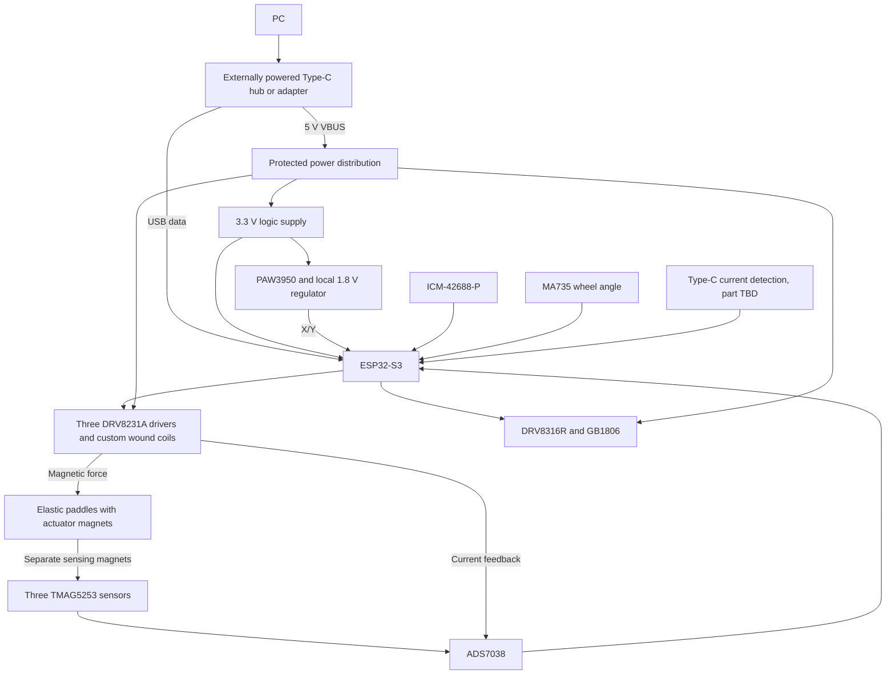

# V1 architecture

V1 is a wired USB mouse with three independently sensed, actively haptic buttons
and a motorized scroll wheel. Wireless operation and additional functional ICs
are outside the current feature scope; supporting power/protection circuitry
still needs to be selected.

| Requirement | Target / interpretation |
| --- | --- |
| Cursor | PAW3950 optical X/Y tracking |
| Supplementary motion | ICM-42688-P lift/orientation experiments; not the cursor source |
| Buttons | Left, middle, right; magnetic position sensing without switch contacts |
| Button return | Elastic paddle/flexure supplies passive return with coil current off |
| Button feedback | Custom moving magnet and stationary wound coil; transient bidirectional effects with position/current feedback |
| Scroll | MA735 absolute angle, programmable BLDC detents/torque |
| Host connection | USB 2.0 Full-Speed HID, target 1 ms report interval |
| Power | 5 V USB-C, source-aware limits; intended 3 A advertised source for full effects |
| Indicator | One RGB status/profile LED |
| Recovery | Reset, boot, programming/test access |

The button direction was revised on 2026-09-08: custom moving-magnet actuators
replace the industrial linear actuators, and elastic paddles provide return
instead of an active holding force or a dedicated magnetic return arrangement.
Each paddle carries separate sensing and actuator magnets. The stationary wound
coil adds bounded press/release effects; it is not required to support the paddle
continuously. Zero commanded coil current is the normal resting/held state after
an effect ends; driver and sensing electronics still consume power.

Retain bidirectional DRV8231A drive for resistance and brief assistance during
snap-through. A single-transistor driver, vibration exciter, and LRA are not the
selected V1 implementation. The smaller dimensions and 0.2-0.4 N actuator-force
target in the [button plan](../mechanical/button-mechanisms/README.md) are
unvalidated prototype targets. Measure force versus position and current before
freezing the coil, magnetic circuit, current limits, or PCB placement.

The mouse is a USB device. An external powered hub is a separate accessory, not
an assumption that every powered downstream port provides 3 A. A custom adapter
is optional future work; its controller, power switch, and Type-C source behavior
need their own design. USB2512B in the notes is only a candidate.

SPI sharing is provisional. Validate transaction latency, device modes and
tri-state behavior before deciding whether the ADC or encoder needs a separate
bus. Pin numbers, loop rates, current limits, USB identifiers, CAD tools, firmware
framework, and the host configuration protocol have not been frozen.

Actuators must remain disabled until power capability, calibration, fault handling,
and limits are valid. Optical tracking and ordinary HID operation should remain
usable with haptics disabled.
