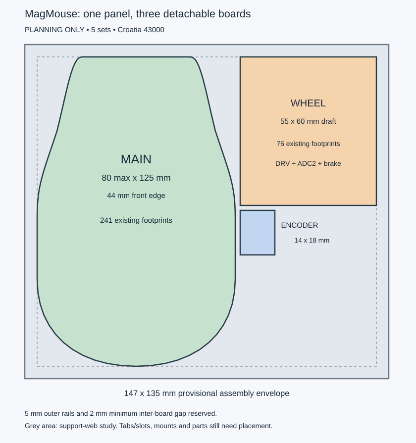

# Modular mouse planning package

2026-09-10. **Planning files only; no modular board is ready to order.**

The target order is five assembled panels, each with one main, one wheel and
one encoder board, delivered to Croatia, 43000. The finished main-board outline
uses the approved 125 mm length, 80 mm maximum width and 44 mm front edge.
Curvature and width-transition locations are draft assumptions from the sketch.



## Concrete outputs

- [Main-envelope.kicad_pcb](planning/Main-envelope.kicad_pcb): editable native
  outline, 80 x 125 mm, with the source motherboard's four-layer stackup.
- [Wheel-envelope.kicad_pcb](planning/Wheel-envelope.kicad_pcb): provisional
  55 x 60 mm reservation; fit of its parts, mounts and connectors is unproven.
- [Encoder-envelope.kicad_pcb](planning/Encoder-envelope.kicad_pcb): 14 x 18 mm
  reservation with the common four-layer stack. The existing routed encoder
  has not yet been converted or transferred into this file.
- [Panel-nesting-study.kicad_pcb](planning/Panel-nesting-study.kicad_pcb):
  147 x 135 mm drawing on Dwgs.User. It has no manufacturing Edge.Cuts, slots
  or breakaway drills. Open in PCB Editor, not 3D Viewer.
- [Partition report](planning/partition-report.json): complete proposed
  reference ownership and both endpoints of every main/wheel boundary net.
- [Partition and harness specification](partition-plan.json): editable inputs.

These outline-only boards have no components or copper. They do not replace
the source motherboard or routed encoder projects. Existing routing and its
previous review status are preserved.

The panel reserves 5 mm outer handling rails and at least 2 mm between unit
envelopes. Grey areas in the drawing are support-web space, not a finished
solid panel: routed slots and supports must be designed around actual loaded
boards. Perforated tabs connect boards mechanically; no electrical nets cross
them. Final tooling, tab access and unit support are still open.

## Circuit partition and interface

The fresh source netlists account for 320 footprints: 241 main, 76 wheel and
3 encoder. Counts include test points and exclude new modular-interface parts.
They are not the number of components that JLCPCB would populate.

Wheel ownership contains U21 DRV8316, U22 disable gates, U23 ADC2 with local
filters/reference/bypass, U24/U26 forward buffers and the complete brake
including comparator, reference, MOSFET, resistors and local capacitors.
SOA/SOB/SOC, their filters and all brake sense/gate/reference connections stay
within that board. Re-place them together before carrying any routes across.

U25 and C53 remain on main for return buffering. The switched encoder power
U28, forward buffer U29/C55 and J6 also remain on main. Retain the existing
[J6-to-J7 harness](../encoder/harness.json) directly to the encoder; routing
encoder traffic through the wheel board is no longer the preferred plan.
The wheel board still needs the ESP32 or a test fixture to commutate the motor.

The main/wheel boundary has **17 nets: 14 digital signals, +3V3, ACT_5V and GND**.
The proposed signal harness has 30 contacts: all odd-numbered pins are GND;
the even pins below each have an adjacent return. This is a logical allocation,
not an approved FFC/connector footprint or cable orientation.

| Pin | Net | Direction |
| --- | --- | --- |
| 2 | SPI_SCLK | Main to wheel |
| 4 | SPI_MOSI | Main to wheel |
| 6 | CS_DRV8316 | Main to wheel |
| 8 | DRV_MISO_LOCAL | Wheel to main |
| 10 | MOTOR_SPI_SCLK | Main to wheel |
| 12 | MOTOR_SPI_MOSI | Main to wheel |
| 14 | CS_ADC2 | Main to wheel |
| 16 | ADC2_MISO_LOCAL | Wheel to main |
| 18 | WHEEL_PWM_A | Main to wheel |
| 20 | WHEEL_PWM_B | Main to wheel |
| 22 | WHEEL_PWM_C | Main to wheel |
| 24 | ACT_DRIVE_EN | Main to wheel |
| 26 | WHEEL_RUN_REQ | Main to wheel |
| 28 | DRV_FAULT_LOCAL_N | Wheel to main |
| 30 | +3V3 | Main to wheel |

ACT_5V and its power return use a separate two-contact harness provisionally.
A candidate is JST SM02B-PASS-TB(LF)(SN),
[JLCPCB C495198](https://jlcpcb.com/partdetail/JST-SM02B_PASS_TB_LF_SN/C495198).
JST rates the [PA family](https://www.jst-mfg.com/product/pdf/eng/ePA-F.pdf)
at 3 A with AWG22. This is not approval for a 3 A motor load: voltage drop,
regenerative pulses, connector temperature, wire size and protection still
need a budget. Header footprint, mating parts, stock and cable sourcing are
not frozen. A 50 mm signal cable is a provisional target, not a tested limit.

## Required changes before schematic extraction is accepted

- Add wheel-local low defaults on WHEEL_RUN_REQ and the three raw PWM inputs.
  Keep R77 on main because its ESP32 boot-strap role must survive unplugging.
  Existing DRV_INHx output pulldowns do not bias U22's disconnected input pins.
- Retain local ACT_DRIVE_EN pulldown R84 and review independent power-up/down
  of +3V3 and ACT_5V. Keep autonomous brake operation independent of the host.
- Define idle bias at cable receivers, including CS inputs and U25's return
  inputs on main. An unplugged wheel must not leave fault or SPI inputs floating
  or let firmware infer a healthy wheel from a disconnected fault line.
- Review partial-power behavior of every buffer, ADC and gate, including
  signal injection when one rail is absent. Confirm from the actual parts'
  datasheets; moving the existing buffers is not proof of safe sequencing.
- Review open/missing power-return faults. Signal cable grounds also connect
  the boards and could become the motor-current return if the power GND opens.
  Do not assume the signal harness is safe for that load. Resolve this with
  rated return paths, connector arrangement and protection before connector
  selection is frozen. Hot plugging is not a validated operating mode.
- Budget SPI3 round-trip delay through cable, buffers and ADC, plus SPI2 loading
  and branches. Provide appropriate source termination after that review and
  verify waveforms on hardware. SPI frequency alone does not define edge quality.
- Select actual connector MPNs and matched cable pin numbering, then add both
  connector endpoints, new bias components and test access to the schematics.
  Verify all 17 boundary nets by pin number in both assembled harnesses and CAD.

## Quote obtained and what remains

The [live JLCPCB calculator](https://cart.jlcpcb.com/quote) displayed
**US $179.47 for five bare 147 x 135 mm panels**, or **$35.89 per set in PCB
fabrication alone**. See the [recorded inputs and itemization](jlcpcb-quote-2026-09-10.json).
Settings: three different designs, four layers, nominal 1.6 mm,
JLC041611-2116, 1 oz outer/inner copper, green mask, ENIG, impedance control
and epoxy-filled/copper-capped vias. The quoted dimensions are provisional.

The calculator also gave $157.08 with ordinary plugged vias. That option is
excluded from the baseline because the current U1/C32/U21 in-pad vias require
filled/capped processing. Merely changing the order checkbox is not a valid
cost reduction for that layout. The browser was restored to filled/capped.

**No assembled or delivered total was obtained.** The assembly screen requires
Gerbers before proceeding. The destination selector returned an empty country
list, so shipping to Croatia could not be calculated. No files were uploaded,
no supplier quote ID was issued and no order was placed. Components, assembly,
cables, shipping and taxes are absent from the $179.47 figure.

JLCPCB treats separable circuits as
[different designs](https://jlcpcb.com/help/article/different-design-in-your-pcb-files).
One panel therefore does not avoid mixed-design fees. Obtain assembly acceptance
for three designs on this panel and delivery with tabs intact. Follow its
[panelization guidance](https://jlcpcb.com/blog/mouse-bite-panelization-guide)
when creating the actual slots and tabs. The price above does not establish
acceptance of the unimplemented assembly panel.

To obtain a final assembled quote, finish the interface schematics, place and
route all units, validate the common encoder stackup, finish panel tooling and
export matching Gerbers/drills/BOM/panel-coordinate CPL. Resolve sensor and
connector sourcing and any assembler exclusions, then price five panels with
all 15 unit boards populated and shipping/tax for Croatia 43000. Compare against
separate boards shipped together before choosing the manufacturing format.

## Regenerate and validate the planning package

Export fresh XML netlists with KiCad before running the generator:

```powershell
$kicadCli = 'C:/Users/cartm/AppData/Local/Programs/KiCad/10.0/bin/kicad-cli.exe'
New-Item -ItemType Directory -Force build/modular | Out-Null
& $kicadCli sch export netlist --format kicadxml -o build/modular/main-netlist.xml hardware/kicad/MagMouse.kicad_sch
& $kicadCli sch export netlist --format kicadxml -o build/modular/encoder-netlist.xml hardware/encoder/Encoder.kicad_sch
python hardware/modular/build_planning.py --main-netlist build/modular/main-netlist.xml --encoder-netlist build/modular/encoder-netlist.xml
```

The generator verifies reference ownership, encoder uniqueness, complete
logical boundary coverage, absence of sensitive analog/phase/brake nets on
the cable, main-board dimensions and panel-envelope spacing. These checks
establish planning consistency only; they do not establish electrical
connectivity, DRC, return paths, thermal performance, mechanical fit or
manufacturing readiness of the future split.

Validation on 2026-09-10: KiCad loaded all four planning files with four copper
layers and no footprints or tracks. All three unit outlines form closed native
polygons; the panel drawing correctly has no board outline. Source PCB reference
sets match the fresh netlists (317 main-source and 3 encoder). Moving an ADC2
filter resistor into the main partition was rejected as two uncovered analog
boundary nets. Quote line items sum to $179.47. The source motherboard SHA256
is unchanged from the start of this planning pass.
