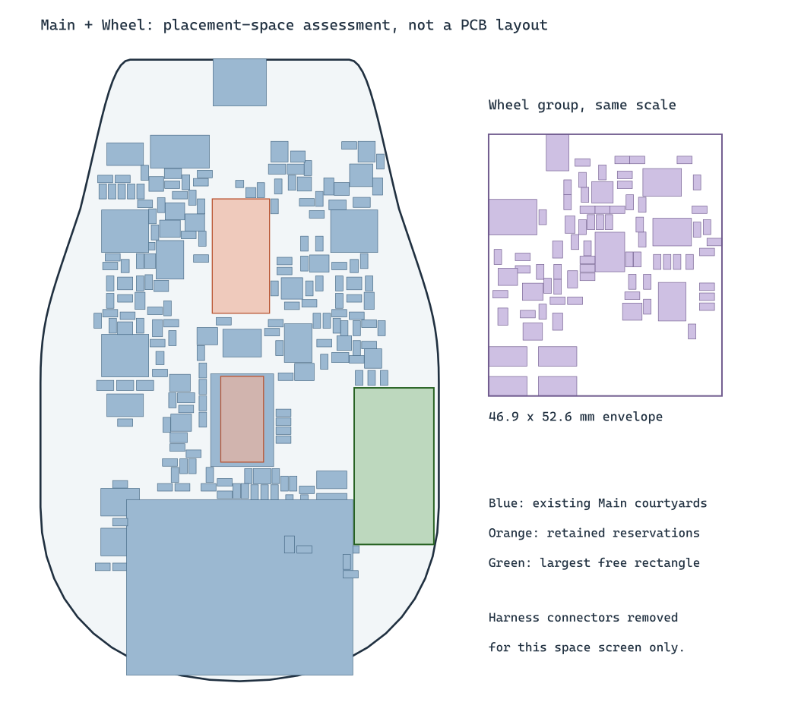

# Main and Wheel consolidation assessment

The existing shaped Main board has enough scattered unused component-side
area to justify a combined-placement study, but it cannot accept the current
Wheel layout as an intact rectangular block. Consolidation means a new
placement and substantial routing work. This assessment does not change the
three active boards or create manufacturing files for a combined board.

The [native KiCad screen](combined-placement-screen.json) uses courtyard
bounding rectangles and a 0.5 mm grid inside the actual curved Main outline.
It provisionally removes Main J8/J10, Wheel J9/J11 and the Main FFC exit
reservation. It retains all other populated parts and rule-area reservations,
including the optical, wheel-mechanism and antenna restrictions. It keeps the
optional IMU footprint as a conservative space allowance.

The remaining Wheel component group spans **46.86 x 52.63 mm**. No unobstructed
rectangle of that size exists on Main at either 0 or 90 degrees. Main's largest
free rectangle is **16 x 31.5 mm**, at (63,66) mm. Approximately 4,086 mm2 of
Main's 8,445 mm2 conservatively rasterized outline remains free of the screened
component boxes/reservations, but it is fragmented. This area measurement
does not establish routing capacity, thermal performance or mechanism fit.

## Proposed placement work

1. Keep USB, the optical sensor/lens datum and ESP32 antenna clearance as
   starting constraints. Keep the upright encoder board separate for the shaft
   magnet; its support and gap still need mechanical definition.
2. Reorganize the board into a motor/actuator region and a logic/optical region.
   Place DRV8316, ADC2, their references and current-output filters as one local
   group, with phase exits facing away from ADC inputs. Keep the brake
   comparator, gate loop, resistor/FET and bulk capacitance near that supply.
3. Move lower-priority digital/support groups to make contiguous space rather
   than distribute the motor group among small gaps. Preserve ADC1/button
   analog locality and an uninterrupted ground reference.
4. Remove the four Main/Wheel harness connectors and their cable reservations
   from a separately derived combined schematic. Review each buffer and bias
   network before removal: some serve switched-rail interfaces, not just cable
   signal conditioning. U25 also serves encoder MISO; U29 remains part of the
   encoder interface. Joining the PCBs does not remove those requirements.
5. Retain two ADCs, the three button drivers, motor driver and autonomous brake.
   These implement the features being retained. Preserve local bypass and
   motor energy storage; reevaluate any redundant supply bulk only with the
   full transient and resistance calculations.
6. Check courtyards, mechanical envelopes and the power/current-sense topology
   before routing. Then repeat DRC/parity, USB, analog, return-plane, SPI and
   high-current regressions on the new board. Mounting and mechanism fit are
   still provisional; zero DRC will not settle them.

## Cost interpretation

Consolidation removes a separate Wheel fabrication job and one Standard
setup/stencil operation (EUR 29.03 in the current two-set quotes). Sixteen
stocked part IDs are shared between Main and Wheel, so a combined BOM may
also eliminate about EUR 21 of duplicated feeder charges under the observed
Standard pricing. Those are batch savings, not per-board savings. Component
and connector reductions require a reviewed combined BOM.

Use the corrected fabrication prices when estimating these savings; the
earlier Wheel EUR 98.68 included the unnecessary small-via/Kelvin-test tier.
The combined board's fabrication cost must be quoted for its final dimensions,
stack and assembly side count. Assuming it stays at the present Main price
is a conditional model, not proof that a finished combined board costs that
amount. A combined layout or breakaway panel has not been quoted.

The separate boards remain the valid electrical reference and prototype
fallback. Do not discard their routed work while exploring consolidation.
