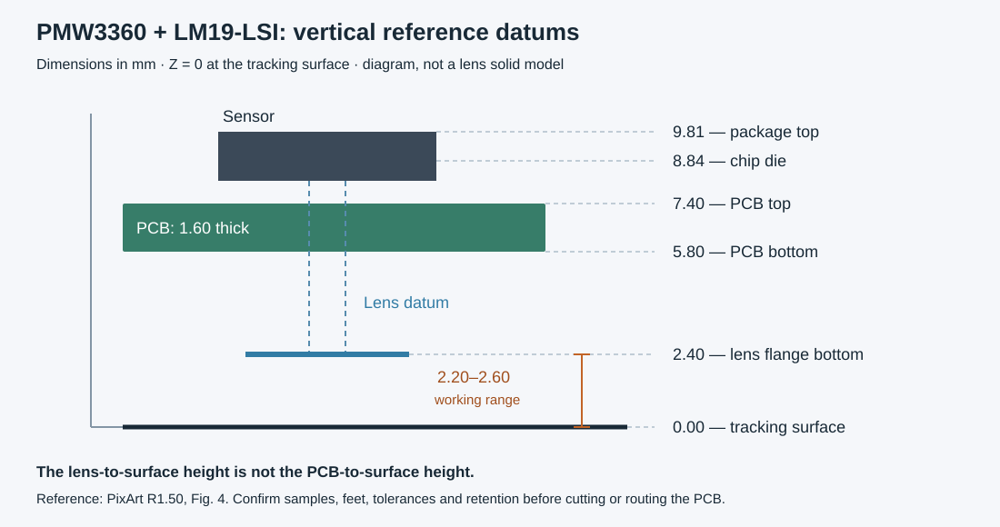

# PMW3360 / LM19-LSI mechanical starting point

The selected pair is PMW3360DM-T2QU + **LM19-LSI**. Dimensions below come from
Figures 3, 4 and 6 of the
[PixArt PMW3360 datasheet R1.50](https://datasheet.lcsc.com/datasheet/pdf/c018c3e1d470821feefadd37e2f785d5.pdf?productCode=C20612443).
They are reference dimensions, not measurements of delivered parts or approval
of the current 50x95mm motherboard outline.

The drawing is a dimensional diagram, not an optical solid model. Z=0 is the
tracking surface. The **2.4mm nominal working height starts at the bottom of
the lens flange**, not at the PCB. The specified operating range is 2.2..2.6mm.
With the illustrated 1.6mm PCB, its top is nominally 7.40mm above the surface
and its bottom 5.80mm above it. The lens sets the sensor height; changing PCB
thickness does not authorize changing lens-to-surface spacing.

| Datum or envelope | Nominal reference |
| --- | --- |
| Lens flange bottom above tracking surface | 2.40mm; operating range 2.20..2.60mm |
| PCB top / bottom above surface | 7.40mm / 5.80mm with 1.60mm PCB |
| Chip die / package top above surface | 8.84mm / 9.81mm |
| Bottom of sensor lead frame to lens flange bottom | 6.71mm, +0.08/-0.04mm |
| Lead frame bottom to package top | 0.70mm, +/-0.05mm |
| Lens flange XY envelope | 21.15 x 18.85mm; not centered on the optical axis |
| Recommended PCB opening | 17.26 x 8.60mm, asymmetric about optical center |

The custom footprint uses the optical center as (0,0). In its top view the
mouse front points along -X. Pin 1 is (5.66,-5.35)mm; pins 1..8 run left in
1.78mm steps. Pin 9 is (-7.69,5.35)mm; pins 9..16 run right in 1.78mm steps.
Recommended finished holes are 0.70mm. The opening spans X=-8.82..8.44mm and
Y=-4.30..4.30mm. It is shown on Dwgs.User only until fit is reviewed. It is not
a standard DIP-16 footprint, nor is that opening the baseplate light aperture.

The lens drawing is PNLR-019-LSI-G8_011. Do not replace its guide posts, molded
optical surfaces, retention details or baseplate opening with the rectangular
envelope above. Obtain the matching supplier drawing/application note
PMS0122-LM19-LSI-AN before designing retention or heat staking.

The PCB-first placement now uses optical centre X=125.5, Y=157.5mm in KiCad,
25.5mm from the board's left edge and 57.5mm behind its front edge. U35 is on
F.Cu at 270 degrees so its front points toward USB (-Y). The sensor body sits
above the PCB and its lens below; do not flip the sensor to B.Cu. A conservative
20 x 22mm underside assembly envelope is drawn about this centre, allowing for
the flange's asymmetric position. This envelope is a planning guide, not a
replacement for the lens shape or a verified clearance to every part.

Provisional motherboard placement can proceed without an outer-shell model.
Before freezing the optical mounting, measure an exact sensor/lens pair, confirm
the seating relationship and lead fit, and make a 1:1 aperture coupon. Set the shell,
feet thickness/compression/wear and local PCB supports so button forces do not
change optical height. Keep feet close enough to stabilize the tracking region.
Check travel across the full working-height range and representative surfaces,
with wheel/button haptics active. Then freeze mounting holes, the baseplate
light opening and board cutout together. No supplier has confirmed samples yet.
